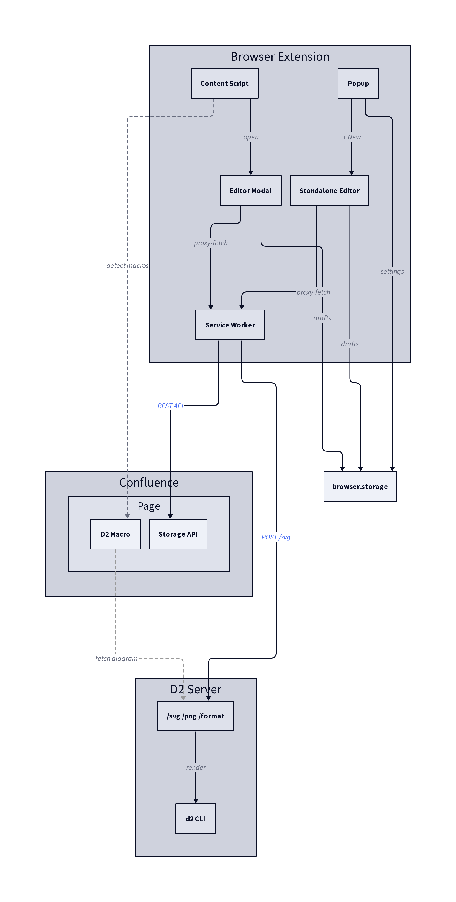

# D2 Diagram Editor for Confluence

Browser extension that lets you edit [D2](https://d2lang.com/) diagrams directly on Confluence pages — without opening the page editor.

Works with Chrome and Firefox.

## Table of Contents

- [Architecture](#architecture)
- [Features](#features)
- [Prerequisites](#prerequisites)
- [Install from stores](#install-from-stores)
- [Local development](#local-development)
  - [Requirements](#requirements)
  - [Setup](#setup)
  - [Build](#build)
  - [Load into browser](#load-into-browser)
  - [Dev mode (watch)](#dev-mode-watch)
  - [Test](#test)
- [Project structure](#project-structure)
- [Configuration](#configuration)
- [License](#license)

## Architecture



This extension is part of a two-component system:

| Component | Repository | Purpose |
|-----------|-----------|---------|
| **D2 Macro** + **D2 Server** | [d2-server](https://github.com/veschin/d2-server) | Confluence user macro (Velocity template) + Clojure HTTP server that renders D2 → SVG/PNG via the `d2` CLI |
| **D2 Extension** | this repo | Browser extension — inline editor with live preview, syntax highlighting, drafts, and export |

### How they connect

The **D2 macro** (`macro.vtl`) is a Confluence user macro that stores D2 code in the macro body and renders diagrams by fetching from the D2 server. Each macro has parameters: `server`, `theme`, `layout`, `direction`, `scale`, `sketch`, `format`, `preset`.

The **D2 server** is a stateless Clojure/Jetty service exposing:

| Endpoint | Purpose |
|----------|---------|
| `POST /svg` | Render D2 code to SVG |
| `POST /png` | Render D2 code to PNG (via headless Chromium) |
| `POST /format` | Format D2 code |

The **extension** detects D2 macros on the page, injects edit buttons, and opens an editor modal. The editor sends code to the same D2 server for live preview and error diagnostics. On save, the extension writes back to Confluence storage (view mode) or updates the TinyMCE DOM (edit mode).

Without the extension, macros still render diagrams — the macro's own JavaScript fetches from the server and caches results in IndexedDB.

## Features

- **Inline editing** — click the pencil icon on any D2 macro to open the editor overlay
- **Live preview** — SVG rendering with zoom, pan, and configurable debounce
- **Syntax highlighting & autocomplete** — powered by tree-sitter WASM parser
- **Error diagnostics** — live linting from D2 server error responses
- **Reference library** — browse reusable D2 blocks from designated Confluence pages, drag-and-drop into editor
- **Standalone editor** — create diagrams outside Confluence (extension popup → "+ New")
- **Export** — SVG, PNG, or copy to clipboard
- **Draft auto-save** — never lose work; drafts persist across sessions
- **Diagram options** — theme, layout engine (elk/dagre), direction, scale, sketch mode
- **View & edit mode** — works in both Confluence view mode (saves via REST API) and edit mode (updates TinyMCE DOM)

## Prerequisites

1. **Confluence instance** with the D2 user macro installed ([d2-server → macro.vtl](https://github.com/veschin/d2-server))
2. **Running D2 server** — deploy via Docker (`make docker-build` in the d2-server repo) or run locally with `make run`
3. **Configure the server URL** — either per-macro (the `server` parameter, default in macro.vtl) or globally in extension settings

## Install from stores

- **Chrome**: [Chrome Web Store](https://chromewebstore.google.com/) (pending review)
- **Firefox**: [Firefox Add-ons](https://addons.mozilla.org/) (pending review)

## Local development

### Requirements

- Node.js 18+
- npm 9+
- GNU Make

### Setup

```bash
git clone https://github.com/veschin/d2-web-extension.git
cd d2-web-extension
npm ci
```

### Build

```bash
make firefox    # build + lint + package Firefox extension
make chrome     # build + package Chrome extension
make sources    # create source archive (for AMO submission)
make clean      # remove build artifacts
```

### Load into browser

#### Firefox

```bash
make dev
```

This builds the extension, launches Firefox, and opens `about:debugging`. The extension reloads automatically on code changes.

To load manually: open `about:debugging#/runtime/this-firefox` → "Load Temporary Add-on" → select any file in `dist-firefox/`.

#### Chrome

```bash
npm run dev:chrome
```

Then load the extension manually:

1. Open `chrome://extensions`
2. Enable "Developer mode" (toggle in top right)
3. Click "Load unpacked"
4. Select the `dist-chrome/` directory

The extension rebuilds on code changes, but you need to click the refresh icon on the extension card in `chrome://extensions` to reload.

### Dev mode (watch)

```bash
make dev            # Firefox: rebuild + auto-reload
npm run dev:chrome  # Chrome: rebuild only (manual reload needed)
```

### Test

```bash
npm test              # run all tests (vitest)
npm run test:watch    # watch mode
npm run typecheck     # TypeScript check (tsc --noEmit)
```

## Project structure

```
src/
├── content/          # content script — injected into Confluence pages
│   ├── main.ts       # entry point, imports detector + overlay + editor
│   ├── detector.ts   # finds D2 macros on the page
│   ├── overlay-buttons.ts  # pencil edit buttons
│   └── editor-modal.ts     # full editor UI (Shadow DOM)
├── background/       # MV3 service worker — message routing, CORS proxy
├── popup/            # extension popup — macro list, settings, debug log
├── options/          # options page — reference sources, server URL
├── standalone/       # standalone editor tab — drafts, export
├── editor/           # CodeMirror setup, D2 language support, linting
└── shared/           # types, API clients, settings, utilities
assets/               # icons, WASM files, fonts
```

## Configuration

- **Extension popup → Settings**: custom D2 server URL, editor font size, storage management
- **Extension options page**: reference library sources (Confluence pages with reusable D2 blocks)
- **Per-macro parameters**: `server`, `theme`, `layout`, `direction`, `scale`, `sketch`, `format`, `preset`

## License

[MIT](LICENSE)
